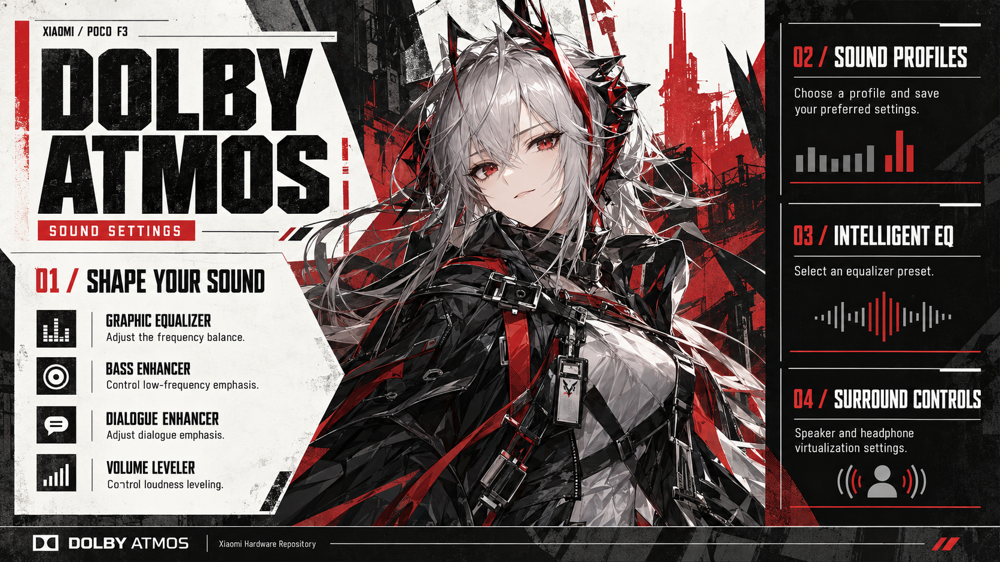

# Xiaomi Dolby Atmos integration



Android platform integration for Xiaomi Dolby effects, developed with POCO F3
(alioth) stock MIUI/HyperOS behavior as a reference. Includes the XiaomiDolby
settings app, effect control/recovery, endpoint selection and shared DMS SELinux
policy. The proprietary Dolby DSP/effect binaries remain external dependencies;
this project does not implement or replace their signal processing.

## Current environment

Maintained on `PocoF3Releases/hardware_xiaomi`, branch `cnb`, for the Android 17
Evolution X tree. The primary device is POCO F3 (alioth), using the QDSP Dolby
contract with matching vendor binaries. Other Xiaomi products must provide and
verify their own effect contracts and tuning. MiSound in XiaomiParts is a separate effect integration. This directory remains
part of standalone `hardware/xiaomi`; device properties and codec packaging
belong in the applicable device/vendor trees.

## Implementation status

“Implemented” describes source behavior, not proof that every vendor binary,
route or installed ROM has passed listening and lifecycle tests.

| Area | Implemented | Limits |
|---|---|---|
| Media controls | Enable/disable, built-in and named profiles, saved per-profile settings, profile reset and reset-all | Requires compatible native effect parameters |
| Equalization and enhancement | Graphic EQ/presets, intelligent EQ, bass enhancement, volume leveler, dialogue enhancement and speaker/headphone virtualization controls | Audible quality and leveler dynamics require route-specific listening tests |
| State recovery | Serialized reconciliation, bounded retries, audio-server recovery, profile acknowledgments and invalidation before native resets | Command acknowledgment is not DSP measurement |
| Communication handling | Playback/recording and audio-mode monitoring; bypass media processing during communication and restore saved media state afterward | Calls, game voice chat and recovery still need coverage on the fixed installed build |
| Output tuning | Speaker, wired, A2DP and USB endpoint selection; product-gated portrait/landscape speaker choices | Unknown/native routes are left to native policy; supported IDs must exist in vendor tuning |
| Spatializer integration | Capability-gated endpoint handling | Alioth does not enable Android spatializer support; Dolby virtualization is a different feature |
| AC-4 playback (external codec integration) | Product-selected OMX decoder compatibility and helper-library path in frameworks/device sources | Official stereo/48 kHz sample decoded successfully and audible playback was confirmed; not a test of all AC-4 streams or offload routes |
| Game audio | Capability-gated HyperOS game-effect controller, editable app selection and tuning in Dolby settings | Not proof of a working standalone Dolby VQE effect on alioth |
| UI | Main/Equalizer/Settings tabs, all 20 EQ bands visible, precise band editor, custom profiles, status dialog, Quick Settings tile and persisted AOSP/Dossier appearance | Normal-size device screenshots reviewed; large fonts, landscape and accessibility still need broader coverage |
| SELinux | Shared DMS domain/service labels, audio and codec binder rules, capability-property readers and boot initializer | Must be integrated once; device trees must remove duplicate DMS declarations |

## Architecture and source map

| Source | Responsibility |
|---|---|
| [DolbyEngine.kt](src/co/aospa/dolby/xiaomi/DolbyEngine.kt) | Effect lifecycle, settings replay, profiles and processing gates |
| [DolbyController.kt](src/co/aospa/dolby/xiaomi/DolbyController.kt) | Serialized requests and runtime-state publication |
| [DolbyAudioEffect.kt](src/co/aospa/dolby/xiaomi/DolbyAudioEffect.kt) / [DolbyWireCodec.kt](src/co/aospa/dolby/xiaomi/DolbyWireCodec.kt) | Native effect commands and binary parameter encoding |
| [DolbyAudioState.kt](src/co/aospa/dolby/xiaomi/DolbyAudioState.kt) | Shared communication-state detection |
| [DolbyEndpointPolicy.kt](src/co/aospa/dolby/xiaomi/DolbyEndpointPolicy.kt) | Route-specific tuning selection and conservative fallback |
| [GameEffectController.kt](src/co/aospa/dolby/xiaomi/GameEffectController.kt) | Product-gated game-audio lifecycle and app settings |
| [profiles/](src/co/aospa/dolby/xiaomi/profiles/) / [geq/](src/co/aospa/dolby/xiaomi/geq/) | Profile storage/settings and equalizer |
| [sepolicy/](sepolicy/README.md) | DMS integration and Dolby property permissions |

Related code lives outside this repository:

- `frameworks/av/services/audioflinger/DolbyDapController.*`: selected-binary
  contract handling, DAP attachment, per-output pregain and compatible track
  metadata, bounded recovery and dumpsys bookkeeping. The QDSP path must not
  receive private commands intended for the legacy software implementation.
- `frameworks/av/media/libstagefright/ACodec.cpp`: Dolby AC-4 decoder setup and
  table-initialization error handling. AC-4 decoding is separate from DAP effects.
- `device/xiaomi/sm8250-common`: product properties, audio configuration and
  vendor prebuilt integration. MiSound/XiaomiParts is a separate effect stack.

Stock Alioth native and decompiled HyperOS sources were used as behavioral
references, not build inputs. Maintainer-only dump paths are not prerequisites
for using this integration. See the [project evidence record](https://github.com/PocoF3Releases/Agents.md/blob/main/today/2026-09-24-ac4-validation-and-thermal-dialog.md)
for AC-4 failure signatures, implementation details and recorded test results.

## Product integration

Ship `XiaomiDolby` and its required permissions through the product configuration.
The app is platform-signed, privileged and installed in system_ext; it is not a
standalone APK intended for arbitrary phones. Explicitly add `XiaomiDolby` to
`PRODUCT_PACKAGES`; its `required` dependency installs the privileged permission
allowlist. `dolby.mk` adds the vendor SELinux policy directory only—it does not
add the app or proprietary components:

```make
include hardware/xiaomi/dolby/dolby.mk
PRODUCT_PACKAGES += XiaomiDolby
```

The Alioth common product also selects `DSPVolumeSynchronizer`. Supply matching
DMS/effect binaries, service registration, audio-effects configuration and vendor
tuning separately. Integrate the shared DMS policy once and remove duplicate
device declarations. See [policy ownership](sepolicy/README.md).

| Property | Purpose / alioth selection |
|---|---|
| `ro.vendor.audio.dolby.dax.support` | Enables the product Dolby integration |
| `ro.vendor.audio.dolby.dax.version` | Vendor version contract; alioth uses `DAX3_3.6` |
| `ro.vendor.audio.dolby.dap.control` | `none`, `qdsp` or `legacy`; alioth selects `qdsp` |
| `ro.vendor.audio.dolby.speaker_tuning.support` | Opt-in for verified speaker tuning IDs; alioth selects true |
| `ro.vendor.audio.dolby.spatializer.support` | Android spatializer integration; alioth selects false |
| `vendor.audio.dolby.control.tunning.by.volume.support` | Vendor spelling is intentional; alioth selects false |
| `ro.vendor.audio.game.effect` | Gates the separate HyperOS game-effect path; do not enable without HAL support |

Do not infer private-command compatibility from the DAX version string alone or
copy capability settings to another device without checking its binaries.

## Independent framework opt-ins

The matching [frameworks/av fork](https://github.com/PocoF3Releases/frameworks_av)
provides two independent, default-off Soong options. They are selected in the
[SM8250 common board configuration](https://github.com/PocoF3Releases/device_xiaomi_sm8250-common/blob/aosp-17/BoardConfigCommon.mk):

```make
$(call soong_config_set_bool,audio,legacy_dap_integration,true)
$(call soong_config_set_bool,media,dolby_ac4_21_entry_tables,true)
```

- **`audio.legacy_dap_integration`** compiles the private DAP framework
  integration. Its name describes the integration ABI, not a requirement to use
  the software effect backend. Alioth still selects `dap.control=qdsp` at runtime.
  Product properties alone do not enable the compiled integration.
- **`media.dolby_ac4_21_entry_tables`** selects the Alioth-compatible OMX AC-4
  request: 21-entry B/C tables, a 452-byte structure and private table index
  `0x6f400009`. The shared OMX enum is not changed; the default request/index path
  remains unchanged for products that do not opt in.

These flags are not interchangeable. A device shipping Dolby effects need not
ship this AC-4 decoder, and a newer Dolby Codec2 component does not establish
compatibility with the legacy OMX request. Verify each binary contract rather
than enabling both options based on the Dolby brand or version string.

## AC-4 codec dependencies and validation

AC-4 decoding is separate from the XiaomiDolby controls and DAP enhancement.
Alioth's 32-bit `OMX.dolby.ac4.decoder` dynamically loads
`/vendor/lib/vndk/libstagefright_omx.so` and resolves `function_a`, `function_b`
and `function_c`. The common device tree packages `libstagefright_omx.vendor`
and `dolby_ac4_omx_legacy_path`, which links that legacy path to the current
`/vendor/lib/libstagefright_omx.so`. Keep codec registration and matching vendor
binaries alongside this dependency; installing XiaomiDolby alone does not supply
a decoder.

The recorded failures were an unsupported table index, followed by
`Error 4 in dlb_ac4dec_input_stage_open` after the index was corrected. The latter
was resolved by restoring the OMX helper lookup path. The audit did not justify
additional VNDK foundation/xlog symlinks or replacing the current helper with an
entire stock VNDK stack.

On the rebuilt Alioth Android 17 `user` installation, a diagnostic explicitly
selected `OMX.dolby.ac4.decoder` and decoded an official 32-second Dolby stereo
sample at 48 kHz:

```text
RESULT input=800 outputBuffers=800 pcmBytes=6144000 nonzeroBytes=5970795 eos=true
PASS
```

The maintainer separately played the original video and confirmed audible sound.
This establishes the tested stereo playback path, not every multichannel
presentation, application, passthrough or offload configuration. The
[diagnostic and output](https://github.com/PocoF3Releases/Agents.md/tree/main/evidence/ac4)
and [detailed checkpoint](https://github.com/PocoF3Releases/Agents.md/blob/main/today/2026-09-24-ac4-validation-and-thermal-dialog.md)
are available without access to the development workstation.

## Appearance and usability

The default appearance follows system Settings colors and filled preference surfaces.
The **Settings tab > Dossier theme** switch selects an app-local alternative with
condensed headings, numbered sections, angular panels, decorative rules, static
texture and diagonal accents. Both appearances support light/dark mode. This switch
is independent of the separate system-wide customization engine.

The main page uses a transparent Dolby Atmos logo in the default theme and the
approved illustrated banner in Dossier. Images preserve their aspect ratio and fit
the available width. The duplicate activity title bar was removed; app navigation
and system-bar icon contrast follow the active appearance.

The graphic equalizer displays all 20 bands without horizontal scrolling, with a
curve view and a selected-band editor for precise adjustment. Dossier uses red for
positive gains and gray at or below zero. Stock-theme slider tracks and panel/text
contrast were refined. Custom profiles and game controls live in the Settings tab;
the redundant Appearance heading was removed.

See [appearance documentation](docs/UI-THEMES.md) and [translation guidance](TRANSLATING.md).

## Recorded DAP control and UI validation

The earlier boot-property blocker is **resolved in the recorded rebuilt-device
checks**. The old `control=none, captured=0` snapshot describes the pre-fix build,
not the current validation result. The policy requires both the shared `vendor_init` setter permission here
and removal of duplicate device policy. Use the current trees rather than
cherry-picking historical intermediate hashes blindly.

Recorded successful checks on alioth:

- All four dedicated properties initialized with the expected QDSP/capability
  values; no matching vendor_init property-set denial appeared in the captured log.
- AudioFlinger captured DAP and acknowledged attachment during playback. Pregain
  desired and acknowledged values matched, with zero reported attachment/pregain
  failures in the observed test window.
- Native and framework processing gates switched Off and back On with the master
  toggle. Automatic speaker tuning restored the factory endpoint.
- Portrait and Landscape choices acknowledged their respective speaker tuning IDs.
- Movie/Video -> Music -> Movie/Video switching succeeded during continuous playback.
- Reset current profile and reset all profiles cleared saved overrides as intended;
  master enable and unrelated game preferences were preserved. Empty profile maps
  correctly represent use of native factory defaults.
- The redesigned app was installed for UI iteration. Supplied device screenshots
  show both appearances, the complete EQ band table, banners and corrected title bar.
  Subsequent stock-surface refinements are included in the maintained UI.
- Later user testing reported smooth operation. The supplied 07:48 device
  screenshots show the Dossier UI reporting "Enabled for media" outside a call
  and "Paused for a call or voice chat" during a call, while preserving the
  enabled preference and Movie/Video selection. This confirms the displayed
  call-bypass state; post-call restoration and DSP behavior need separate
  observation.
- Targeted AAPT2 and Kotlin/Compose checks passed during UI development. The real
  Dossier PNG also passed AAPT2 compilation after a stray Windows metadata sidecar
  was removed from the resource directory.

These results establish the tested control/UI paths. They are not measurements of
DSP output or certification of every route. The [reconciled control-path evidence](https://github.com/PocoF3Releases/Agents.md/blob/main/today/2026-09-24-rework-memory-reconciliation.md)
preserves the important findings remotely; raw device logs and user preferences
are not distributed in this repository.

## Not implemented or not established

- A replacement for proprietary Dolby processing, arbitrary-device compatibility,
  or guaranteed support for every parameter exposed by newer HyperOS versions.
- Validated standalone Dolby VQE activation on alioth. A game-effect control path
  and communication bypass must not be described as proof of VQE processing.
- Android spatial audio/head tracking on alioth or reconstructed rotation-specific
  speaker spatializer behavior from incomplete stock code.
- Exhaustive AC-4 format, multichannel and offload coverage beyond the validated
  stereo sample above. Plugin/library presence alone is not decoding proof.
- Exhaustive call, Bluetooth/USB, offload, audio-server restart and listening tests
  across all supported outputs and lifecycle transitions; objective DSP readback is also not provided.

## Installed-build checklist

1. Confirm the four dedicated Dolby properties exist after boot and no vendor_init
   property-set denials recur.
2. During playback, inspect `adb shell dumpsys media.audio_flinger` for
   `control=qdsp`, DAP capture/attachment and retry state. These are bookkeeping.
3. Test profiles, EQ, leveler, enable/disable, speaker tuning and output changes
   at a comfortable volume; save and restore the original settings.
4. Exercise communication entry/exit and media recovery, then restart recovery
   in a controlled test. Confirm no stuck bypass or repeated native failures.
5. When changing codec binaries or packaging, repeat the AC-4 sample test and
   inspect decoder selection/errors independently of Dolby enhancement settings.
   The recorded success does not validate a different decoder ABI.

Documentation-only edits do not require a build. Packaged artwork, resources, code
and policy changes require rebuilding the affected components. Use a matching installed
build for release validation; the checks above do not certify later ROM changes.
